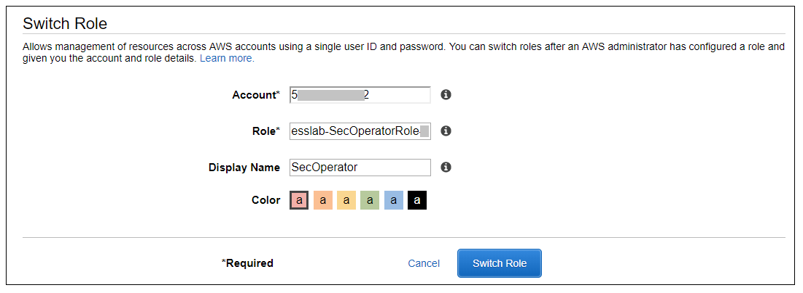

# External Security Services Round (Verify Phase)

| IMPORTANT NOTE!  |
|---|
| Please make sure you have followed the instructions in the instructions in the **[scenario section](./index.md)** and the **[build phase](./build.md)** before continuing below. |

## The Verification Challenge:  Test how the environment was built

In the previous phase, you tested the environment that *you* built.
Your goal in this section is to evaluate the security of the environments that were built *by another team*.

Depending on how you're doing this workshop, expand one of the following dropdowns to sign in to AWS.

??? info "AWS-sponsored event"

    1. In a separate tab in your web browser, go to the URL provided to you and login. 

    2. After you login click the **AWS Account** box, then click on the Account ID displayed below that (the red box in the image.) You should see a link below that for the **Management console**. Click on that and you will be taken to the AWS console. 

    

??? info "Individual or an event not sponsored by AWS"

    In a separate tab in your web browser, go to https://aws.amazon.com/console and log into your account.

## Verify the Security Operator role

1. Go to the CloudFormation console and view the outputs tab of the CloudFormation stack named *esslab*.

2. Click on the URL next to SecOperatorRoleURL.
A new browser tab window will appear showing information similar to the image below.

    

    The box contains the account ID (which is the ID of your AWS account), a role name that was created by CloudFormation, and a Display Name.
You can also select a color that will be used to display the role you assume in the console.

    Click **Switch Role**.

    You will now see a new role label named *SecAdministrator* in the top of your console window as shown below.

    

    This means that your *effective* privileges have been *temporarily*  replaced with those of the SecOperator role.

3. Now go to the Amazon Inspector Console.  Click **Assessment Templates** and check the box to the left of the template name that begins with *LampInspectorAssessmentTemplate* and click **Run**.  After several seconds you will see an error message telling you that you are not authorized to call the StartAssessmentRun action.
This is because you have read-only access to Inspector.

4. Now go to the GuardDuty console, click **Settings**, change the **Updated findings** field, and click **Save settings**.  You will see an error message telling you that you are not authorized to perform the UpdateDetector action (the message may appear beneath the first IAM error message).  This is because you have read-only access to GuardDuty.

5.  Go to the Macie console, select the us-west-2 region, click on **Settings** and click on the Content Type icon.
You will see a list of file types appear.
Pick a file type such as *application/cap*, edit it and change the value of the *Enabled* flag and click **Save**.
You will receive an error message because you have read-only access to Macie.
Close the Macie window.

6.  Go back to the console session that you had for GuardDuty and from there go to the CloudTrail console.

7.  Select the trail whose name begins with *esslab*.

8. Toggle the Logging switch to OFF.  You will be asked to confirm.  Click **Continue**.  You will receive an error message because you have read-only access to CloudTrail.

9. Now switch back to your default role.  After you to this the SecOperator role label will no longer appear on your console.

## Discuss your findings

Discuss any variances you find and share them with the team that built the environment.

## Clean Up

In order to prevent charges to your account we recommend cleaning up the infrastructure that was created, especially if you are doing other Identity rounds. Expand one of the following dropdowns and follow the instructions:

??? info "AWS Sponsored Event"

    No cleanup required! The responsibility falls to AWS.

??? info "Individual or an event not sponsored by AWS"

    Follow the steps below to remove the core componenets.

    1. [Delete the main (not the nested) CloudFormation stack](https://docs.aws.amazon.com/AWSCloudFormation/latest/UserGuide/cfn-console-delete-stack.html).  This will in turn delete the nested stack that represents the Macie Activity Generator.  Wait until both the main and nested CloudFormation stacks have been deleted.

    2. [Disable Amazon Macie](https://docs.aws.amazon.com/macie/latest/userguide/macie-disable.html).

    3. [Disable Amazon GuardDuty](https://docs.aws.amazon.com/guardduty/latest/ug/guardduty_suspend-disable.html).

    4. [Delete the logging bucket](https://docs.aws.amazon.com/AmazonS3/latest/user-guide/delete-bucket.html).

Congratulations on completing the External Security Services round!
