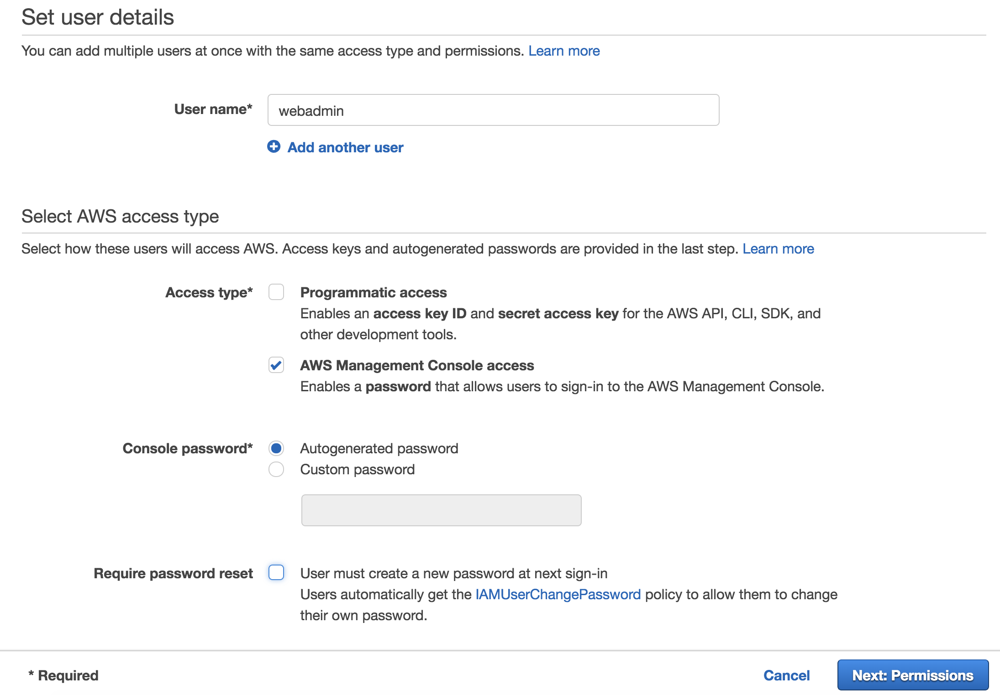

# Permissions boundaries round <small>Build Phase</small>

Below are a series of tasks to delegate permissions to the web admins. In these tasks you will be creating policies and testing them. It helps to divide the team into people doing the tasks and people testing things out. 

## Setup Instructions

To setup your environment please expand one of the following drop-downs (depending on how if you are doing this workshop at an **AWS event** or **individually**) and follow the instructions: 

??? info "AWS Sponsored Event"

	**Console Login:** if you are attending this workshop at an official AWS event then your team should have the URL and login credentials for your account. This will allow you to login to the account using AWS SSO. Browse to that URL and login. 

	After you login click **AWS Account** box, then click on the Account ID displayed below that (the red box in the image.) You should see a link below that for **Management console**. Click on that and you will be taken the AWS console. 

	

	Make sure the region is set to Ohio (us-east-2)

	**CloudFormation:** Launch the CloudFormation stack below to setup the environment:

	Region| Deploy
	------|-----
	US East 2 (Ohio) | [](https://console.aws.amazon.com/cloudformation/home?region=us-east-2#/stacks/new?stackName=Perm-Bound&templateURL=https://s3-us-west-2.amazonaws.com/sa-security-specialist-workshops-us-west-2/identity-workshop/permissionboundary/identity-workshop-web-admins.yaml)

	1. Click the **Deploy to AWS** button above.  This will automatically take you to the console to run the template.  
	2. Click **Next** on the **Select Template** section.
	3. Click **Next** on the **Specify Details** section (the stack name will be already filled - you can change it or leave it as is)
	4. Click **Next** on the **Options** section.
	5. Finally, acknowledge that the template will create IAM roles under **Capabilities** and click **Create**.

	This will bring you back to the CloudFormation console. You can refresh the page to see the stack starting to create. Before moving on, make sure the stack is in a **CREATE_COMPLETE**.

??? info "Individual"

	Log in to your account however you would normally

	**CloudFormation:** Launch the CloudFormation stack below to setup the environment:

	Region| Deploy
	------|-----
	US East 2 (Ohio) | [](https://console.aws.amazon.com/cloudformation/home?region=us-east-2#/stacks/new?stackName=Perm-Bound&templateURL=https://s3-us-west-2.amazonaws.com/sa-security-specialist-workshops-us-west-2/identity-workshop/permissionboundary/identity-workshop-web-admins.yaml)

	1. Click the **Deploy to AWS** button above.  This will automatically take you to the console to run the template.  
	2. Click **Next** on the **Select Template** section.
	3. Click **Next** on the **Specify Details** section (the stack name will already be filled - you can change it or leave it as is)
	4. Click **Next** on the **Options** section.
	5. Finally, acknowledge that the template will create IAM roles under **Capabilities** and click **Create**.

	This will bring you back to the CloudFormation console. You can refresh the page to see the stack starting to create. Before moving on, make sure the stack is in a **CREATE_COMPLETE**.

## Task 1 <small>Create an IAM user and an IAM policy with permission to create managed policies, IAM roles and Lambda functions</small>

Build an IAM policy so that web admins can create customer managed policies, IAM roles and Lambda functions. They should only be able to edit the policies, roles and lambda functions they create. 

!!! Attention
	As you use the provided IAM policy hints in each task, keep in mind where you need to add the account ID, correctly use the resource restrictions and change the region specified if needed (although if you are taking this as part of an AWS event, please use the Ohio region or us-east-2.) Missing any of these items can cause issues with your policies

### Walk Through

* Browse to the [IAM console](https://console.aws.amazon.com/iam/home).
* On the first screen you see in the IAM console (which should be the Dashboard) you will see an **IAM users sign-in link**. Copy that link because you will need the account ID in the URL for the policies and you will need the entire URL when you hand this account to another team for the **VERIFY** phase. 

* Click **Users** on the left menu and create a new IAM user named **`webadmin`**. Check **AWS Management Console access** and then either autogenerate a password or set a custom password. Uncheck **Require password reset**. Attach the AWS managed policies **IAMReadOnlyAccess** & **AWSLambdaReadOnlyAccess** to the user.

* Next click **Policies** on the left menu. Create a new IAM policy based on the hint below. Attach this policy to the IAM user you created.

!!! hint
	[IAM Identifiers](https://docs.aws.amazon.com/IAM/latest/UserGuide/reference_identifiers.html): You will want to use either naming or pathing resource restrictions in the IAM policy. The question marks "**????**" in the resource element below should be replaced with something that could act as a resource restriction. Examine the existing resources (roles, Lambda functions) to make sure the policy will give access to existing resources owned by the web admins. Replacing the question marks is really the key to this round. 

``` json
{
    "Version": "2012-10-17",
    "Statement": [
        {
            "Sid": "CreateCustomerManagedPolicies",
            "Effect": "Allow",
            "Action": [
                "iam:CreatePolicy",
                "iam:DeletePolicy",
                "iam:CreatePolicyVersion",
                "iam:DeletePolicyVersion",
                "iam:SetDefaultPolicyVersion"
            ],
            "Resource": "arn:aws:iam::ACCOUNT_ID:policy/????"
        },
        {
            "Sid": "CreateRoles",
            "Effect": "Allow",
            "Action": [
                "iam:CreateRole",
                "iam:UpdateRole",
                "iam:DeleteRole",
                "iam:AttachRolePolicy",
                "iam:DetachRolePolicy"
            ],
            "Resource": [
                "arn:aws:iam::ACCOUNT_ID:role/????"
            ]
        },
        {
            "Sid": "LambdaFullAccesswithResourceRestrictions",
            "Effect": "Allow",
            "Action": "lambda:*",
            "Resource": "arn:aws:lambda:us-east-2:ACCOUNT_ID:function:????"
        },
        {
            "Sid": "PassRoletoLambda",
            "Effect": "Allow",
            "Action": "iam:PassRole",
            "Resource": "arn:aws:iam::ACCOUNT_ID:role/????",
            "Condition": {
                "StringLikeIfExists": {
                    "iam:PassedToService": "lambda.amazonaws.com"
                }
            }
        },
        {
            "Sid": "AdditionalPermissionsforLambda",
            "Effect": "Allow",
            "Action": ["kms:ListAliases", "logs:Describe*", "logs:ListTagsLogGroup", "logs:FilterLogEvents", "logs:GetLogEvents"],
            "Resource": "*"
        }
    ]
}
```

* You should login with the **webadmin** IAM user (using a different browser) to verify the user can create a policy (while following the resource restriction.) Use the **IAM users sign-in link** you gathered earlier to login. The permissions assigned to the policy do not matter for the test.
* From the browser where you are logged into the console as the **webadmin**, verify  you can create a role (while following the resource restriction.) This role should use Lambda as the trusted entity (we will use this role to test the next task). The policy attached to the role do not matter at this point. 
* Again from the browser where you are logged into the console as the **webadmin**, verify the user can create a lambda function (while following the resource restriction.) 

!!! question
	* Why are we using resource restrictions here?
	* There are two ways of doing resource restrictions: naming and pathing. Which option allows you to create policies using both the AWS Console and CLI?
	* Are resource restrictions in this case of Lambda function creation really necessary?

## Task 2 <small>Create a permissions boundary</small>

The webadmins can create IAM polices, IAM role and Lambda functions. We now need to limit the permissions of the roles they create though. If not then the web admins could simply create new policies with full admin rights, attach these to the roles, pass these roles to Lambda functions and escalate their permissions (either intentionally or inadvertently). We will use permissions boundaries to limits the effective permissions of the roles. The permissions boundary should allow the following [effective permissions](https://docs.aws.amazon.com/IAM/latest/UserGuide/reference_policies_evaluation-logic.html) for any role created by the web admins:

>	i. Create log groups (but can not overwrite any other log groups)

>	ii. Create log streams and put logs

>	iii. List the objects from the S3 bucket name that starts with `"web-admins-"` and ends in `"-data"`

### Walk Through: 

* Create a new IAM policy that will act as the permissions boundary for the web admins. Name the policy **`webadminpermissionboundary`**

!!! hint
	[IAM Identifiers](https://docs.aws.amazon.com/IAM/latest/UserGuide/reference_identifiers.html): The question marks **`????`** in the resource element below should be replaced with something that could act as a resource restriction. 

``` json
{
    "Version": "2012-10-17",
    "Statement": [
        {
            "Sid": "CreateLogGroup",
            "Effect": "Allow",
            "Action": "logs:CreateLogGroup",
            "Resource": "arn:aws:logs:us-east-2:ACCOUNT_ID:*"
        },
        {
            "Sid": "CreateLogStreamandEvents",
            "Effect": "Allow",
            "Action": [
                "logs:CreateLogStream",
                "logs:PutLogEvents"
            ],
            "Resource": "arn:aws:logs:us-east-2:ACCOUNT_ID:log-group:/aws/lambda/????:*"
        },
        {
            "Sid": "AllowedS3GetObject",
            "Effect": "Allow",
            "Action": [
                "s3:List*"
            ],
            "Resource": "arn:aws:s3:::web-admins-ACCOUNT_ID-*"
        }
    ]
}
```

!!! question
	* What do you attach the permission boundary to?
	* How could you test the permissions boundary at this point?
	* From the standpoint of the policy language and how it is presented in the console, how does a permissions boundary differ from a standard IAM policy?

## Task 3 <small>Update the permission policy for the webadmin to incorporate the permissions boundary condition</small>

### Walk Through

You now need to update the policy you created in Task 1 with the permissions boundary condition. It is recommended that you just create a new policy and use the example below. 

Note that the policy below contains two additional sections (the last two sections) that we did not address in the earlier tasks. The additions are focused on denying the ability to change or delete the permission policy or the permissions boundary. Also the policy below includes the permissions boundary conditions.

* Name the new policy **`webadminpermissionpolicy`** and attach it to the webadmin user. Remove the earlier policy you added during the testing.
* When you are done the **webadmin** user should have only three policies attached: webadminpermissionpolicy, IAMReadOnlyAccess & AWSLambdaReadOnlyAccess.
		
!!! hint 
	[permissions boundaries](https://docs.aws.amazon.com/IAM/latest/UserGuide/access_policies_boundaries.html): The question marks **`????`** in the resource elements below should be replaced with something that could act as a resource restriction. 

``` json
{
    "Version": "2012-10-17",
    "Statement": [
        {
            "Sid": "CreateCustomerManagedPolicies",
            "Effect": "Allow",
            "Action": [
                "iam:CreatePolicy",
                "iam:DeletePolicy",
                "iam:CreatePolicyVersion",
                "iam:DeletePolicyVersion",
                "iam:SetDefaultPolicyVersion"
            ],
            "Resource": "arn:aws:iam::ACCOUNT_ID:policy/????"
        },
        {
        	  "Sid": "RoleandPolicyActionswithnoPermissionBoundarySupport",
            "Effect": "Allow",
            "Action": [
            		"iam:UpdateRole",
                	"iam:DeleteRole"
            ],
            "Resource": [
                "arn:aws:iam::ACCOUNT_ID:role/????"
            ]
        },
        {
            "Sid": "CreateRoles",
            "Effect": "Allow",
            "Action": [
                "iam:CreateRole",
                "iam:AttachRolePolicy",
                "iam:DetachRolePolicy"
            ],
            "Resource": [
                "arn:aws:iam::ACCOUNT_ID:role/????"
            ],
            "Condition": {"StringEquals": 
                {"iam:PermissionsBoundary": "arn:aws:iam::ACCOUNT_ID:policy/webadminpermissionboundary"}
            }
        },
        {
            "Sid": "LambdaFullAccesswithResourceRestrictions",
            "Effect": "Allow",
            "Action": "lambda:*",
            "Resource": "arn:aws:lambda:us-east-2:ACCOUNT_ID:function:????"
        },
        {
            "Sid": "PassRoletoLambda",
            "Effect": "Allow",
            "Action": "iam:PassRole",
            "Resource": "arn:aws:iam::ACCOUNT_ID:role/????",
            "Condition": {
                "StringLikeIfExists": {
                    "iam:PassedToService": "lambda.amazonaws.com"
                }
            }
        },
        {
            "Sid": "AdditionalPermissionsforLambda",
            "Effect": "Allow",
            "Action": 	["kms:ListAliases", "logs:Describe*", "logs:ListTagsLogGroup", "logs:FilterLogEvents", "logs:GetLogEvents"],
            "Resource": "*"
        },
        {
            "Sid": "DenyPermissionBoundaryandPolicyDeleteModify",
            "Effect": "Deny",
            "Action": [
                "iam:CreatePolicyVersion",
                "iam:DeletePolicy",
                "iam:DeletePolicyVersion",
                "iam:SetDefaultPolicyVersion"
            ],
            "Resource": [
                "arn:aws:iam::ACCOUNT_ID:policy/webadminpermissionboundary",
                "arn:aws:iam::ACCOUNT_ID:policy/webadminpermissionpolicy"
            ]
        },
        {
            "Sid": "DenyRolePermissionBoundaryDelete",
            "Effect": "Deny",
            "Action": "iam:DeleteRolePermissionsBoundary",
            "Resource": "*"
        }
    ]
}
```

* Again from the browser where you are logged into the console as the **webadmin**, verify the user can create a policy, create a role (attaching both a permission policy and permissions boundary to the role) and finally create a Lambda function into which you will pass that role. All of the preceding steps need to be done will also following the resource restrictions. 

!!! question
	* "Why do we add the Deny for DeletePolicy actions?"
	* "What would happen if we didn't deny the ability to delete permissions boundaries?"

## Task 4 <small>Gather info needed for the **VERIFY** phase</small>

### Walk Through

Now that you have setup the IAM user for the web admins, it's time to pass this information on to the next team who will work through the **VERIFY** tasks. You need to gather some details about your setup and then hand this info to the next team.

Here are all of the details you need to pass to another team. If you following the recommended naming conventions than you can use the answers below.  If you were given a form to fill out then enter the info into the form. This needs to be given to another team so they can do the **VERIFY** phase tasks. Your team should collect the **VERIFY** phase form from another team so you can also work through the **VERIFY** tasks. 

* IAM users sign-in link:	**https://Account_ID.signin.aws.amazon.com/console**
* IAM user name:	**webadmin**
* IAM user password:	
* Resource restriction identifier:	
* permissions boundary name: **webadminpermissionboundary**
* Permission policy name: **webadminpermissionpolicy**

!!! tip 
	Do not hand out this info to the same team that is giving you the info - this way we will end up properly swapping between teams if we have an odd number of teams.

### <small>[Click here to go to the VERIFY phase](./verify.md)</small>